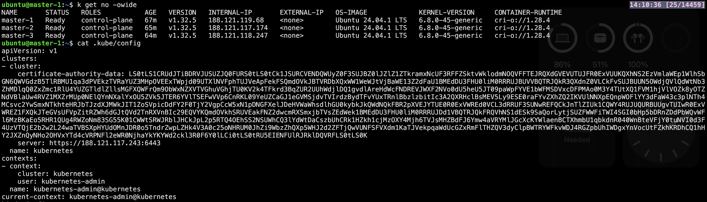
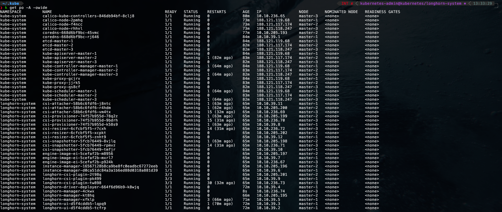
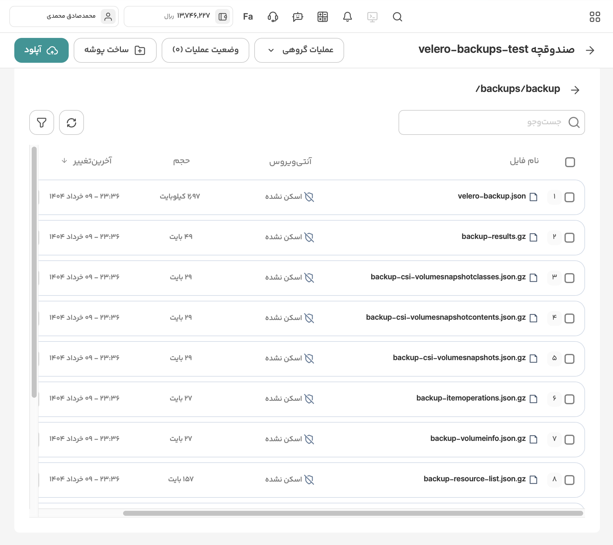
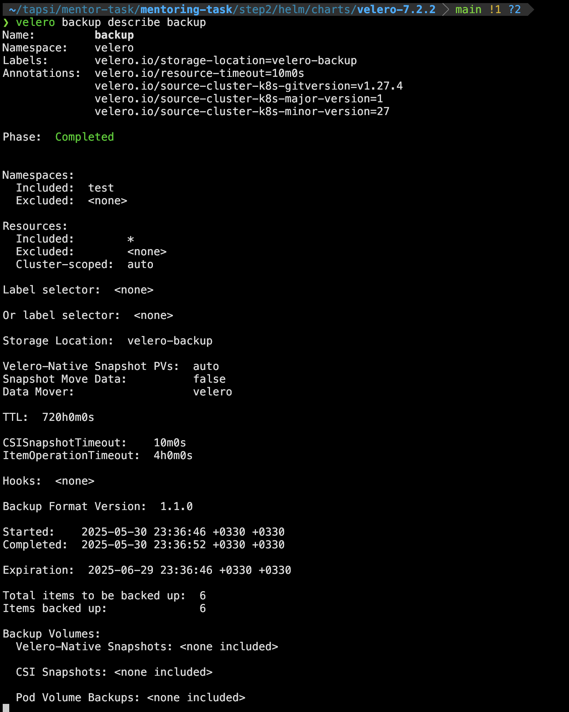
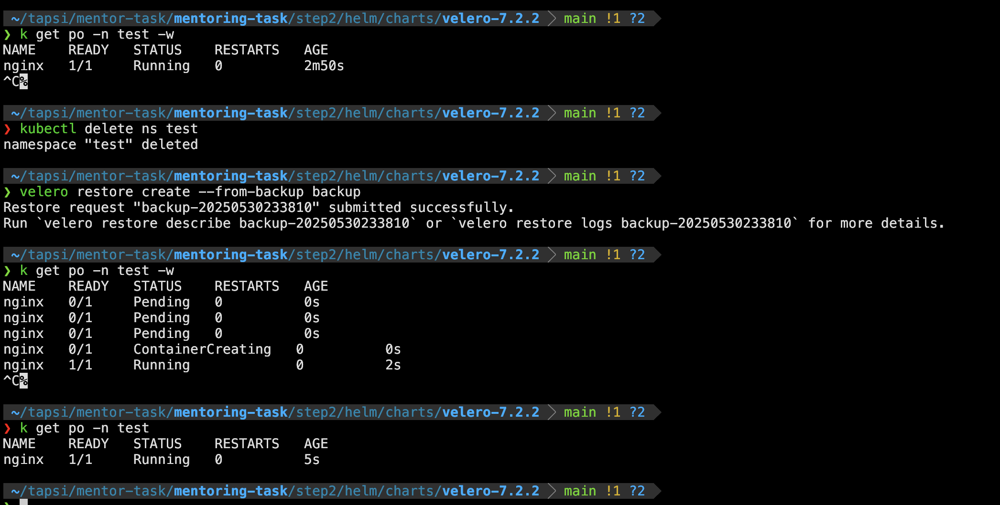
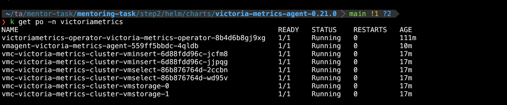
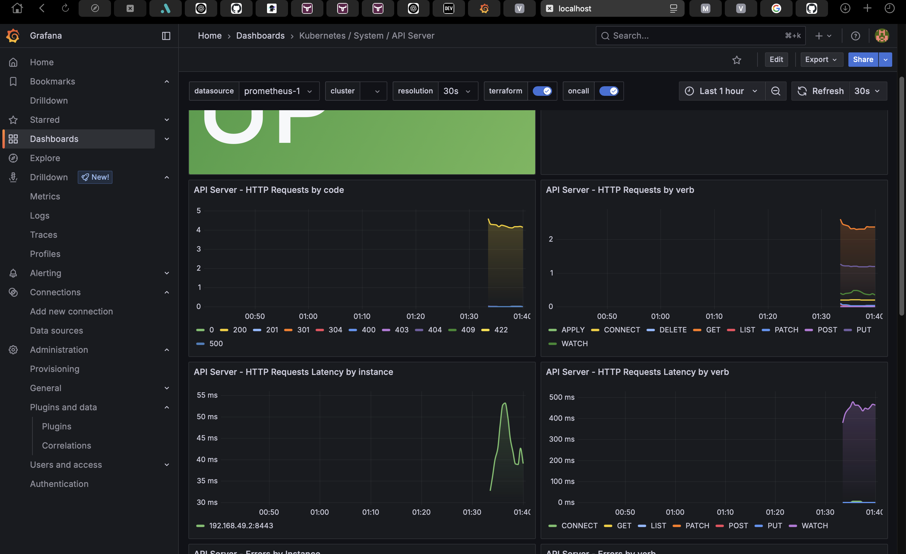
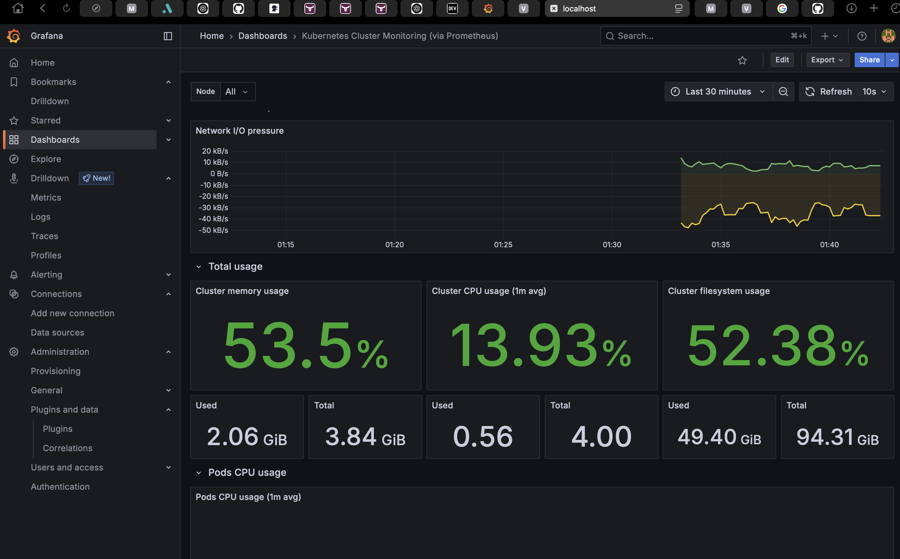
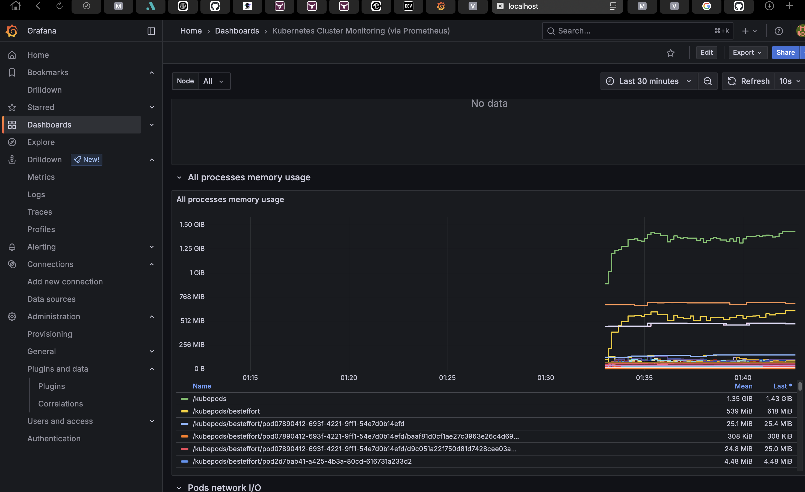
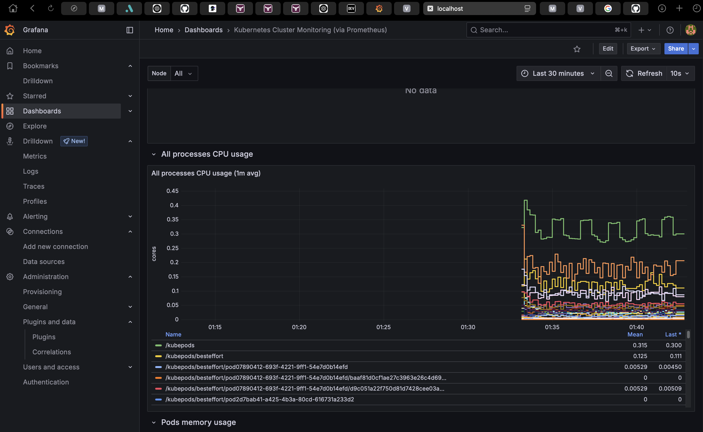

# Step 2 - Part 1: Kubernetes Cluster Setup

This step provisions virtual machines on ArvanCloud using **Terraform** and configures a high-availability **Kubernetes cluster** using **Ansible**.

---

## VM Topology

We provision the following nodes:

- **1 HAProxy Node** – Load balances traffic to control plane nodes
- **3 Control Plane Nodes** – Run Kubernetes control plane components ans also workload in this example

---

## Terraform: VM Provisioning on ArvanCloud

We use a reusable module called `terraform-arvan-vm` to provision the VMs.

### Directory Structure

```bash
terraform/
├── main.tf           # Uses the VM module for each node group
├── variables.tf      # Input variable definitions
└── terraform.tfvars  # Actual values for variables
````

---

## Ansible: Kubernetes Cluster Configuration

Ansible automates the installation and configuration of:

* Kubernetes Control Plane and Worker Nodes
* HAProxy for load balancing
* CRI-O as the container runtime
* Calico as the CNI plugin
* Longhorn for persistent storage

### Directory Structure

```bash
ansible/
├── inventory/
│   └── hosts.ini        # Defines haproxy, controlplane, and worker groups
├── roles/
│   ├── haproxy/         # Configures HAProxy load balancer
│   ├── crio/            # Installs and configures CRI-O runtime
│   ├── kubernetes/      # Sets up Kubernetes (kubeadm-based)
│   ├── calico/          # Applies Calico CNI configuration
│   └── longhorn/        # Deploys Longhorn for dynamic volumes
└── main.yml             # Master playbook that orchestrates all roles
```

---

## Outcome

At the end of this step, you’ll have:

* A fully functional Kubernetes cluster

* HA load-balanced control plane
* CRI-O, Calico, and Longhorn integrated and running


---

## Prerequisites

* Terraform ≥ 1.3
* Ansible ≥ 2.14
* SSH key pair for VM access
* ArvanCloud API key

---

Here's a `README.md` for **Part 2: Velero Deployment and Backup Configuration** using the **Velero Helm chart** with **Arvan Object Storage**, based on your setup and the screenshot results:

---

# Step 2 - Part 2: Velero Deployment & Backup to Arvan Object Storage

This step sets up [Velero](https://velero.io) using the official **Helm chart** to enable automated Kubernetes backups. Backups are stored in an **Arvan Object Storage** bucket.

---

## Prerequisites

- A running Kubernetes cluster
- `helm` installed and configured
- ArvanCloud S3-compatible Object Storage credentials (access key + secret)
- A bucket (e.g., `velero-backups-test`) created in Arvan panel

---

## Deployment Instructions

### 1. Add the Velero Helm repo

```bash
helm repo add vmware-tanzu https://vmware-tanzu.github.io/helm-charts
helm repo update
````

### 3. Install Velero with Helm

```bash
helm install velero . -f values-prod.yaml -n velero
```

---

## Backup Files in Arvan

After a successful backup, Velero will upload backup artifacts to your S3 bucket under `/backups/backup`.

Example output from a successful backup:



---

## Verification

To verify Velero is working:

```bash
kubectl get backups -n velero
```

To inspect the contents of a backup:

```bash
velero describe backup <backup-name> -n velero
```



To restore:

```bash
velero restore create --from-backup <backup-name>
```



---

## 3. Velero Backup & Restore Procedure

### Backup Configuration (`values.yaml`)

This is a test scheduled via the Helm chart:

```yaml
test:
  disabled: false
  schedule: "1 * * * *"  # every hour
  useOwnerReferencesInBackup: false
  template:
    ttl: "48h"
    includedNamespaces:
      - kube-system
```

This configuration creates automatic hourly backups of the `kube-system` namespace, retained for 48 hours.

### Manual Backup

To manually trigger a backup:

```bash
velero backup create kube-system-backup --include-namespaces kube-system --ttl 48h
```

### Restore a Backup

To restore the latest backup:

```bash
velero restore create --from-backup kube-system-backup
```

You can verify restore status with:

```bash
velero restore get
velero restore describe <restore-name>
```

---

## Backup Artifacts Location

Backups are stored in the configured Arvan Object Storage.

Includes:

* `velero-backup.json`
* `backup-results.gz`
* Resource state JSON files

---

# Step 3 - Part 3: Cluster Monitoring with VictoriaMetrics + Grafana & Backup Procedure

This step sets up a full monitoring and backup solution for your Kubernetes cluster. It includes:

- Deployment of **VictoriaMetrics** stack using Helm
- Configuration to scrape metrics from `kube-system`
- **Grafana** dashboards for CPU, memory, and pod status

---

## 1. Deploy VictoriaMetrics Stack (via Helm)

We use the [VictoriaMetrics Helm chart](https://github.com/VictoriaMetrics/helm-charts) to install:

- `vm-operator`
- `vm-cluster`
- `vm-agent`

### Add Helm Repo

```bash
helm repo add victoria-metrics https://victoriametrics.github.io/helm-charts/
helm repo update
````

### Create Namespace

```bash
kubectl create ns victoriametrics
```

### Install vm-operator

```bash
 helm install vmoperator . -f values-prod.yaml -n victoriametrics 
```

### Install vm-cluster

```bash
 helm install vmcluster . -f values-prod.yaml -n victoriametrics 
```

### Install vm-agent

Customize values (especially scrape configs) to scrape `kube-system` metrics.

```yaml
- job_name: "kubernetes-pods"
  kubernetes_sd_configs:
    - role: pod
  relabel_configs:
    - action: drop
      source_labels: [__meta_kubernetes_pod_container_init]
      regex: true
    - action: keep_if_equal
      source_labels: [__meta_kubernetes_pod_annotation_prometheus_io_port, __meta_kubernetes_pod_container_port_number]
    - source_labels: [__meta_kubernetes_pod_annotation_prometheus_io_scrape]
      action: keep
      regex: true
    - source_labels: [__meta_kubernetes_pod_annotation_prometheus_io_path]
      action: replace
      target_label: __metrics_path__
      regex: (.+)
    - source_labels:
        [__address__, __meta_kubernetes_pod_annotation_prometheus_io_port]
      action: replace
      regex: ([^:]+)(?::\d+)?;(\d+)
      replacement: $1:$2
      target_label: __address__
    - action: labelmap
      regex: __meta_kubernetes_pod_label_(.+)
    - source_labels: [__meta_kubernetes_namespace]
      action: replace
      target_label: kubernetes_namespace
    - source_labels: [__meta_kubernetes_pod_name]
      action: replace
      target_label: kubernetes_pod_name
```

Then install:

```bash
helm install vmagent . -f values-prod.yaml -n victoriametrics 
```



---

## 2. Deploy Grafana & Create Cluster Health Dashboard

### Install Grafana

```bash
helm install grafana . -f values-prod.yaml -n monitoring
```

### Import Dashboard

Create or import a dashboard for:

* **CPU usage** (`node_cpu_seconds_total`)
* **Memory usage** (`container_memory_usage_bytes`)
* **Pod status** (`kube_pod_status_phase`)






