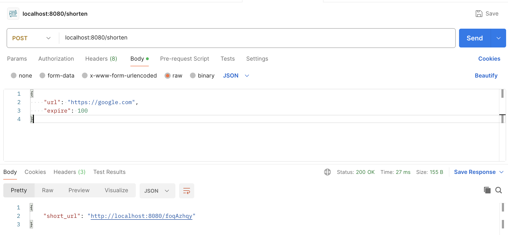
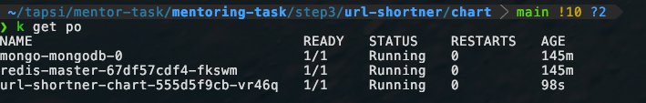
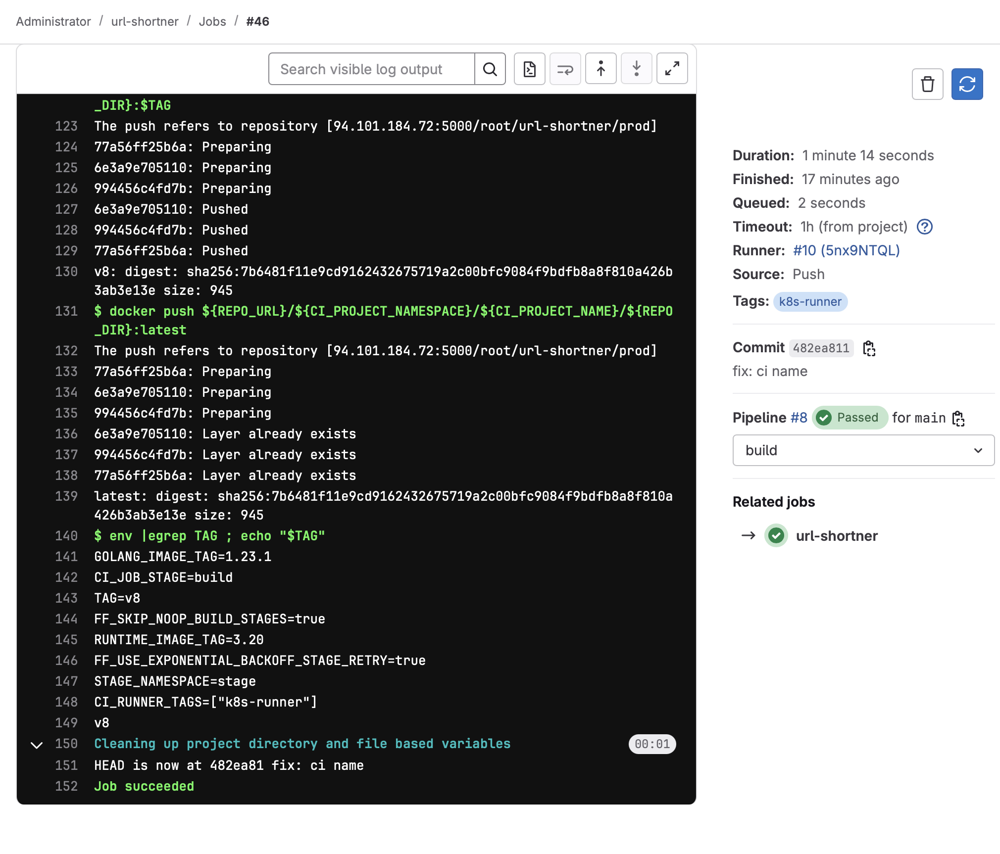
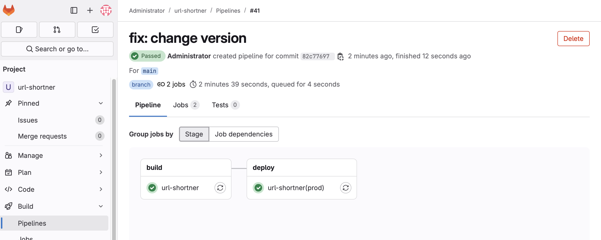
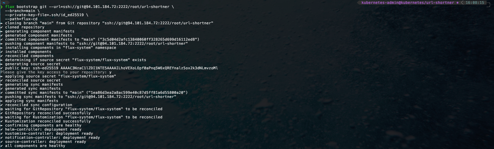
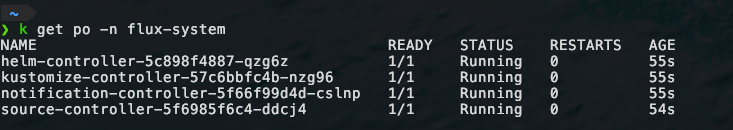
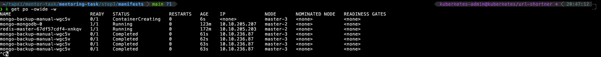
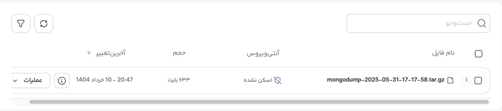

# Step 3 - Part 1: URL Shortener Microservice (Golang + Redis + MongoDB)

This service provides a simple URL shortener REST API written in Go, using Redis for caching and MongoDB for persistence. It is deployed via Helm and managed using FluxCD.

---

## Features

- Shorten long URLs with expiration
- Redirect short URLs using Redis cache or fallback to MongoDB
- Delete short URLs from both Redis and MongoDB
- Health check endpoint (`/healthz`)
- Configurable via environment variables (via Helm chart)

---

## Tech Stack

- **Golang** (Echo web framework)
- **MongoDB** (URL persistence)
- **Redis** (URL caching)
- **Helm** (for deployment)
- **FluxCD** (for GitOps automation)

---

## API Endpoints

### `POST /shorten`

Shorten a URL with optional expiration time.

**Request Body:**

```json
{
  "url": "https://example.com",
  "expire": 60
}
````

**Response:**

```json
{
  "short_url": "http://<host>/<hash>"
}
```

---

### `GET /:hsh`

Resolves and redirects the shortened URL using the hash.

* Checks Redis cache first
* Falls back to MongoDB if not cached

**Response:** HTTP 301 redirect to original URL.

---

### `DELETE /:hsh`

Deletes a shortened URL from both Redis and MongoDB.

**Response:**

```json
{
  "message": "URL deleted"
}
```

---

### `GET /healthz`

Health check endpoint. Returns:

```
200 OK
```



---

## Configuration

Environment variables are injected via Helm values:

| Variable          | Description        | Default        |
| ----------------- | ------------------ | -------------- |
| `PORT`            | App listen port    | `80`           |
| `MONGOHOST`       | MongoDB host\:port | `localhost`    |
| `REDISHOST`       | Redis host\:port   | `localhost`    |
| `MONGODATABASE`   | MongoDB DB name    | `urlshortener` |
| `MONGOCOLLECTION` | MongoDB collection | `urls`         |

---

## Deployment (via Helm + FluxCD)

### HelmRelease (FluxCD)

```yaml
apiVersion: helm.toolkit.fluxcd.io/v2
kind: HelmRelease
metadata:
  name: url-shortner
  namespace: flux-system
spec:
  chart:
    spec:
      chart: chart
      version: "1.17.0"
      sourceRef:
        kind: GitRepository
        name: url-shortner
        namespace: flux-system

  releaseName: url-shortner
  targetNamespace: url-shortner

  values:
    urlShortnerPort: "80"
    mongoDbHost: mongodb:27017
    redisHost: redis-master:6379
    mongoDbName: urlshortener
    mongoCollection: urls

    image:
      repository: 94.101.184.72:5000/root/url-shortner/prod
      tag: "v12"
      pullPolicy: IfNotPresent

    imagePullSecrets:
      - name: gitlab-pull-secret

    service:
      type: ClusterIP
      port: 80

    limits:
      cpu: 100m
      memory: 128Mi
    requests:
      cpu: 100m
      memory: 128Mi

    livenessProbe:
      httpGet:
        path: /healthz
        port: http
    readinessProbe:
      httpGet:
        path: /healthz
        port: http

    envFrom:
      - configMapRef:
          name: url-shortner-chart
```

---

## To Test Locally

```bash
curl -X POST http://localhost:80/shorten \
  -H "Content-Type: application/json" \
  -d '{"url":"https://google.com", "expire":10}'

curl -v http://localhost:80/<short_id>
curl -X DELETE http://localhost:80/<short_id>
```

---

## 📎 Notes

* Redis used as first-level cache with expiration
* MongoDB used as persistent store
* No authentication is implemented (optional future work)
* Redis and MongoDB are expected to be running in the same cluster

---

## Indexing Strategies and Caching Logic

This service leverages **MongoDB for persistence** and **Redis for caching** to efficiently serve short URLs. Below are the strategies implemented to optimize lookup performance, TTL handling, and minimize DB load.

---

### MongoDB Indexing Strategy

The MongoDB collection used for storing shortened URLs benefits from the following indexing strategies:

#### Primary `_id` Index

* Field: `_id` (i.e., the generated short hash)
* Usage: Efficient lookups when resolving or deleting a shortened URL.
* Benefit: This is a **unique primary key** in MongoDB and ensures O(1) performance when resolving.

#### TTL Index on `expire_at`

To automatically clean up expired URLs from the database, a **TTL (Time-To-Live) index** is created on the `expire_at` field.

```bash
db.urls.createIndex({ "expire_at": 1 }, { expireAfterSeconds: 0 })
```

* Field: `expire_at`
* Usage: Automatic deletion of expired documents.
* Benefit: Prevents long-term buildup of expired URLs without manual intervention.

> ⚠️ **Note:** Ensure this TTL index is created during your MongoDB initialization or via migration logic.

---

### Redis Caching Logic

To reduce latency and database reads for frequently accessed URLs, Redis is used as a cache layer.

#### Key Format

```plaintext
short:<hash> → <original_url>
```

* Example: `short:abc123 → https://example.com/foo`

#### Cache Set Logic (`POST /shorten`)

When a new shortened URL is created:

* It's stored in MongoDB.
* Simultaneously, it's added to Redis with the same expiration duration (`expire` in minutes).

```go
RedisClient.Set(Ctx, "short:"+id, req.URL, time.Duration(req.Expire)*time.Minute)
```

#### Cache Read & Write Back (`GET /:hsh`)

* When resolving a URL:

  1. Redis is checked first.
  2. If the key is not found (`redis.Nil`), it falls back to MongoDB.
  3. If found in MongoDB, the result is **re-cached in Redis** with the remaining TTL (`time.Until(expireAt)`).

This design follows the **lazy caching** pattern and ensures:

* Low latency for popular links.
* Cache rehydration on demand.
* Redis keys auto-expire like the database TTL.

---

### Deletion Behavior

When a user deletes a shortened URL via `DELETE /:hsh`:

* MongoDB removes the document.
* Redis is updated to **remove the cache entry** (if any).

```go
MongoCol.DeleteOne(...)
RedisClient.Del(...)
```

---

### Consistency Model

This setup follows **eventual consistency** between Redis and MongoDB:

| Operation       | MongoDB         | Redis           |
| --------------- | --------------- | --------------- |
| Create (POST)   | ✅               | ✅               |
| Resolve (GET)   | ✅ (fallback)    | ✅               |
| Delete (DELETE) | ✅               | ✅               |
| Expire          | ✅ via TTL index | ✅ via Redis TTL |

This ensures that reads are fast, writes are reliable, and expired content is removed from both storage and cache over time.


---

# Step 3 - Part 2: Deploying URL Shortener to Kubernetes

This step covers deploying all components of the URL shortener microservice stack into a Kubernetes cluster using **Helm charts**:

- ✅ MongoDB (Bitnami Helm Chart)
- ✅ Redis (Bitnami Helm Chart)
- ✅ URL Shortener (custom Helm chart or Kustomize overlay)

---

## Components

### 1. URL Shortener Service

- Built in Golang with Echo
- Uses Redis for caching and MongoDB for persistent storage
- Deployed via HelmRelease and managed by FluxCD

> See Step 3 - Part 1's `README.md` for full details on service functionality.

---

### 2. Redis Deployment (Helm)

**Values configuration used:**

```yaml
global:
  security:
    allowInsecureImages: true
  imageRegistry: "docker.arvancloud.ir"

architecture: standalone

auth:
  enabled: false
  sentinel: false

commonConfiguration: |-
  appendonly yes
  save "43200 0"
  maxmemory 5gb

master:
  kind: Deployment
  persistence:
    enabled: true
    size: 1Gi

  resources:
    limits:
      cpu: 100m
      memory: 100Mi
    requests:
      cpu: 100m
      memory: 100Mi
````

> Deployed using [Bitnami Redis Helm Chart](https://artifacthub.io/packages/helm/bitnami/redis)

**To install manually:**

```bash
helm repo add bitnami https://charts.bitnami.com/bitnami
helm install redis bitnami/redis -f redis-values.yaml
```

---

### 3. MongoDB Deployment (Helm)

**Values configuration used:**

```yaml
global:
  imageRegistry: "docker.arvancloud.ir"
  security:
    allowInsecureImages: true

image:
  repository: bitnami/mongodb
  tag: 8.0.4-debian-12-r0

architecture: standalone
useStatefulSet: true

auth:
  enabled: false
  rootUser: root
  usernames:
    - url-shortner
  databases:
    - urlshortener

replicaCount: 1

updateStrategy:
  type: RollingUpdate

resources:
  requests:
    cpu: 1000m
    memory: 1000Mi
  limits:
    cpu: 1000m
    memory: 1000Mi

containerPorts:
  mongodb: 27017

service:
  nameOverride: "mongodb"
  type: ClusterIP
  portName: mongodb
  ports:
    mongodb: 27017

persistence:
  enabled: true
  name: "data"
  accessModes:
    - ReadWriteOnce
  size: 2Gi
  mountPath: /bitnami/mongodb

metrics:
  enabled: false
```

> Deployed using [Bitnami MongoDB Helm Chart](https://artifacthub.io/packages/helm/bitnami/mongodb)

**To install manually:**

```bash
helm repo add bitnami https://charts.bitnami.com/bitnami
helm install mongodb bitnami/mongodb -f mongodb-values.yaml
```

---

## Deploying the URL Shortener App

You can deploy it using:

* A custom Helm chart defined in your GitOps repo (`url-shortner` HelmRelease in `flux-system`)
* Or manually using Helm

**FluxCD HelmRelease example:**

```yaml
apiVersion: helm.toolkit.fluxcd.io/v2
kind: HelmRelease
metadata:
  name: url-shortner
  namespace: flux-system
spec:
  chart:
    spec:
      chart: chart
      version: "1.17.0"
      sourceRef:
        kind: GitRepository
        name: url-shortner
        namespace: flux-system
  releaseName: url-shortner
  targetNamespace: url-shortner
  values:
    mongoDbHost: mongodb:27017
    redisHost: redis-master:6379
```



---

## Connectivity Overview

```
[ User ] ---> [ Ingress / NodePort ]
                    |
                [ URL Shortener ]
                /         \
         [ Redis ]     [ MongoDB ]
```

* Redis is used as a cache to reduce database hits.
* MongoDB is the primary datastore for shortened URLs.

---

## Testing Locally

```bash
kubectl port-forward svc/url-shortner 8080:80 -n url-shortner
curl -X POST http://localhost:8080/shorten -d '{"url":"https://google.com", "expire":60}' -H "Content-Type: application/json"
```

---

## Step 3, Part 3: CI/CD Pipeline

This part automates the process of:

1. **Building and pushing the Docker image** to GitLab’s container registry.
2. **Automatically updating the image tag in Helm chart values**.
3. **Triggering a deployment** to Kubernetes using **FluxCD** via Git push.

---

## 1. Build & Push Docker Image

GitLab CI is configured to build the Go app using Docker and push the image to a GitLab-hosted Docker registry.

### `.build_image` Template

This template handles:

* Logging into the container registry
* Building the image using `docker buildx`
* Tagging it with:

  * The commit/tag version (`$TAG`)
  * `latest`
* Pushing both tags

```yaml
.build_image:
  script: &build_definition
    - docker login -u ${REPO_USER} -p ${REPO_PASSWORD} ${REPO_URL}
    - docker buildx build --tag ${REPO_URL}/${CI_PROJECT_NAMESPACE}/${CI_PROJECT_NAME}/${REPO_DIR}:$TAG 
        --tag ${REPO_URL}/${CI_PROJECT_NAMESPACE}/${CI_PROJECT_NAME}/${REPO_DIR}:latest
        ...
    - docker push ...
```

### `url-shortner` Build Job

This job:

* Is executed on commits to `main` or `develop`
* Reuses the `*build_definition` script
* Sets key variables such as `GOARCH`, `PROJECT_BINARY_NAME`, and the Go runtime versions

```yaml
url-shortner:
  stage: build
  script:
    - *build_definition
    - env | egrep TAG ; echo "$TAG"
```



---

## 2. Auto-Update Helm Values + Git Push

After building the image, this part updates the Helm chart values to trigger a deployment.

### `.deploy_prod` Template

This template does the following:

* Sets up SSH keys to access the Git repo
* Clones the same GitLab repo (acts as the Flux source)
* Updates `values-prod.yaml` to:

  * Replace the Docker image tag with the current pipeline ID (`v${CI_PIPELINE_IID}`)
  * Bump Helm chart version
* Commits and pushes the changes

```yaml
- 'sed -i -E "s@(tag: \\")v?[^\"]+@\\1v${CI_PIPELINE_IID}@" ${DEPLOYMENT_FILE1}'
- 'sed -i -E "s@(version: \\")[^\"]+@\\1${CHART_VERSION}@" ${DEPLOYMENT_FILE1}'
```

> 🛑 If there are no changes, it skips the commit/push.

---

### `url-shortner(prod)` Deploy Job

This job uses the template above and only runs for changes to the relevant code paths **on the `main` branch**.

```yaml
url-shortner(prod): 
  stage: deploy
  script: *deploy_prod_definition
  environment:
    name: production
```



> 📌 The job is marked `manual`, meaning it won’t run automatically unless you approve it in the GitLab UI—ideal for production safety.

---

## 3. FluxCD Auto-Deploys via Git Push

FluxCD watches the Git repo and redeploys the app automatically when changes are committed to the Helm chart values.

### Install `Fluxcd` with Bootstrap
flux bootstrap is a one-time command used to install and configure FluxCD on your Kubernetes cluster. It sets up all necessary controllers and links your Git repository to the cluster, enabling GitOps: a model where your Git repo is the single source of truth for your Kubernetes environment.

Once bootstrapped, Flux continuously watches your Git repository, and automatically applies any changes (e.g., app updates, Helm chart changes, Kustomizations) to the cluster.

```bash
flux bootstrap git --url=ssh://git@94.101.184.72:2222/root/flux-cd \
  --branch=main \
  --private-key-file=.ssh/id_ed25519 \
  --path=flux-cd
```





### `GitRepository` Resource

Defines the source Git repo and branch (`main`) FluxCD pulls from:

```yaml
apiVersion: source.toolkit.fluxcd.io/v1
kind: GitRepository
metadata:
  name: url-shortner
spec:
  interval: 3m0s
  url: ssh://git@94.101.184.72:2222/root/url-shortner
```

### `Kustomization` Resource

This tells Flux to watch the `chart/` path and deploy any updates to it in the `url-shortner` namespace:

```yaml
apiVersion: kustomize.toolkit.fluxcd.io/v1
kind: Kustomization
metadata:
  name: url-shortner
spec:
  path: chart
  prune: true
  sourceRef:
    kind: GitRepository
    name: url-shortner
```

---

## Full CI/CD Flow Summary

```plaintext
          ┌────────────┐
          │ Git Commit │
          └────┬───────┘
               ▼
     ┌──────────────────────┐
     │ GitLab CI Build Job  │
     └────────┬─────────────┘
              ▼
    Docker image built and pushed
              ▼
     ┌────────────────────────┐
     │ GitLab CI Deploy Job   │
     └────────┬───────────────┘
              ▼
  GitLab repo updated (chart/values)
              ▼
         ┌────────────┐
         │   FluxCD   │
         └────┬───────┘
              ▼
   Kubernetes redeploys the service
```

---

## Step 3 - Part 4: Automated MongoDB Backups with CronJob

This step sets up a **daily backup of your MongoDB database**, packages it as a `.tar.gz`, and **uploads it to ArvanCloud’s S3-compatible object storage** using a Kubernetes-native **CronJob**.

---

### 1. Custom Backup Image

The `Dockerfile` creates a minimal Ubuntu-based container image with:

* `mongodump` (MongoDB official tools)
* `awscli` (to upload backups to S3)
* `gzip` and `tar` (for compression)

```dockerfile
FROM ubuntu:22.04
RUN apt-get update && apt-get install -y mongodb-org-tools awscli gzip tar
```

This image is later pushed to a registry (e.g., `docker.arvancloud.ir/sadegh81/mongo-aws:latest`) and used by the CronJob.

---

### 2. Kubernetes CronJob

This Kubernetes CronJob schedules a MongoDB backup **every day at 2:00 AM**.

```yaml
apiVersion: batch/v1
kind: CronJob
metadata:
  name: mongo-backup
  namespace: url-shortner
spec:
  schedule: "0 2 * * *"
```

The **job logic**:

1. Generates a timestamp.
2. Runs `mongodump` using the configured `MONGO_HOST`.
3. Archives the backup folder as `.tar.gz`.
4. Uploads the archive to the specified S3 bucket.



```sh
mongodump --uri="$MONGO_HOST" --out="$BACKUP_DIR"
tar -czf "/tmp/mongodump-$TIMESTAMP.tar.gz" -C /tmp "mongodump-$TIMESTAMP"
aws s3 cp /tmp/mongodump-*.tar.gz s3://$BUCKET_NAME/ --endpoint-url=https://s3.ir-thr-at1.arvanstorage.ir
```

---

### 3. Configuration via ConfigMap

This `ConfigMap` holds non-sensitive environment variables for the backup job:

```yaml
apiVersion: v1
kind: ConfigMap
metadata:
  name: mongo-backup-config
data:
  BUCKET_NAME: mongodb-urlshortner-backup
  MONGO_HOST: mongodb://mongodb.url-shortner.svc.cluster.local:27017
```

---

### 4. S3 Credentials via Secret

The `Secret` securely provides your AWS-compatible access keys for Arvan's S3:

```yaml
apiVersion: v1
kind: Secret
metadata:
  name: arvan-s3-credentials
type: Opaque
data:
  AWS_ACCESS_KEY_ID: <base64>
  AWS_SECRET_ACCESS_KEY: <base64>
```

> ⚠️ Ensure these values are base64-encoded.



