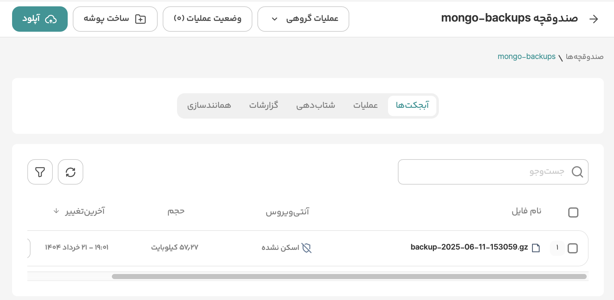

# mongo-operator

## Overview
The mongo-operator is a Kubernetes Operator built with Kubebuilder to manage production-grade MongoDB clusters. It supports automated deployment of replica sets, sharded clusters, and scheduled backups to S3-compatible storage (e.g., ArvanCloud).

This operator manages complex MongoDB topologies using a single MongoDBCluster custom resource, making cluster operations declarative, reproducible, and cloud-native.


## Description
The mongo-operator automates the lifecycle of MongoDB clusters on Kubernetes by abstracting:

- Replica set and sharded cluster creation
- Mongos and config server orchestration
- Persistent storage setup
- Periodic database backups to S3-compatible buckets (e.g., ArvanCloud)
- Transparent support for enabling MongoDB sharding on specific databases and collections


Example CRD:
```yaml
apiVersion: database.sadegh.msm/v1alpha1
kind: MongoDBCluster
metadata:
  name: mongodbcluster-sample
  namespace: default
spec:
  replicaSetCount: 3
  replicaSetSize: 5
  mongosCount: 3
  configServerCount: 5
  storageSize: "2Gi"
  storageClass: "fast-disks"
  version: "7"

  backup:
    enabled: true
    schedule: "0 1 * * *"
    storageEndpoint: "https://s3.ir-thr-at1.arvanstorage.ir"
    bucket: "mongo-backups"
    secretRef:
      name: arvan-s3-secret
      namespace: default

  sharding:
    enabled: true
    database: mydb
    collections: mydb.users
    key: userId

```

## Getting Started

### Prerequisites
- go version v1.24.0+
- docker version 17.03+.
- kubectl version v1.11.3+.
- Access to a Kubernetes v1.11.3+ cluster.

### To Deploy on the cluster
**Build and push your image to the location specified by `IMG`:**

```sh
make docker-build docker-push IMG=sadegh81/mongo-operator:latest
```

**Install the CRDs into the cluster:**

```sh
make install
```

**Deploy the Manager to the cluster with the image specified by `IMG`:**

```sh
make deploy IMG=sadegh81/mongo-operator:latest
```

**Create instances of your solution**
You can apply the samples (examples) from the config/sample:

```sh
kubectl apply -k config/samples/
```


### To Uninstall
**Delete the instances (CRs) from the cluster:**

```sh
kubectl delete -k config/samples/
```

**Delete the APIs(CRDs) from the cluster:**

```sh
make uninstall
```

**UnDeploy the controller from the cluster:**

```sh
make undeploy
```

### Backup Configuration

To enable backups to Arvan S3, create the following secret:
```yaml
apiVersion: v1
kind: Secret
metadata:
  name: arvan-s3-secret
  namespace: default
type: Opaque
data:
  accessKey: BASE64_ENCODED_ACCESS_KEY
  secretKey: BASE64_ENCODED_SECRET_KEY
```
Backups will run as a CronJob inside the cluster at the specified schedule (spec.backup.schedule) using mongodump. The backup tarball is uploaded to the specified bucket on ArvanCloud.




## **Operator Architecture & Backup Workflow**

### a) **Operator Architecture**

Include an architectural diagram or at least describe the components:

* **Custom Resource Definition (CRD)**
  Describes a MongoDBCluster: shard count, replica size, version, backup, etc.

* **Controller (Reconciler)**
  Watches MongoDBCluster objects and creates:

  * StatefulSets for config servers, shards, and mongos
  * Services for discovery
  * CronJobs for scheduled backups
  * Initialization jobs for replica sets and sharding via the MongoDB Go driver

* **Supporting Logic (Packages)**

  * `InitReplicaSet()`: initializes replica sets via Mongo Shell or driver


  * `InitSharding()`: enables sharding on collections


---

### b) **Backup Workflow**

Document:

1. **How the backup CronJob is created** from the CR `spec.backup.schedule`.
2. **What it does**:

   * Connects to each shard/config server
   * Uses `mongodump` to create an archive
   * Compresses and uploads it to `spec.backup.bucket`
3. **Security**:

   * Uses a `Secret` with base64-encoded access/secret keys
   * Ensures credentials are not logged
4. **Failure handling**:

   * Failed jobs should retry or emit Kubernetes Events for alerting

## License

Copyright 2025.

Licensed under the Apache License, Version 2.0 (the "License");
you may not use this file except in compliance with the License.
You may obtain a copy of the License at

    http://www.apache.org/licenses/LICENSE-2.0

Unless required by applicable law or agreed to in writing, software
distributed under the License is distributed on an "AS IS" BASIS,
WITHOUT WARRANTIES OR CONDITIONS OF ANY KIND, either express or implied.
See the License for the specific language governing permissions and
limitations under the License.

